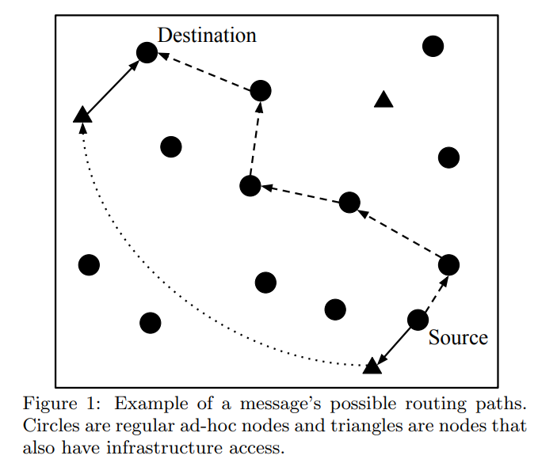

[TOC]

## Advantages of mixing ad hoc mode and infrastructure mode
MANETs(Mobile Ad hoc Networks) has `Ad hoc mode` and `Infrastructure mode`；
* Ad hoc mode: Cheap but not reliable(mobility may cause out of communication range, high delay and frequently changing dynamics)
* Infrastructure based: Reliable but expensive

### What is the benefits of mixing the ad hoc mode and infrastructure-based mode? 
* MANETs

MANETs
> Silva, João A., et al. "Towards the opportunistic combination of mobile ad-hoc networks with infrastructure access." Proceedings of the 1st Workshop on Middleware for Edge Clouds & Cloudlets. 2016.

The problem addressed in this paper is high routing delay of mobile ad hoc networks(MANETs). In MANETs, the message routing from source to destination using ad hoc network may using multihop that may cause high delay. If it has some nodes which have the Internet access, they can be used to transmit message through the Internet that may has lower hop count. Silva et al. propose an algorithm that decides which mode is used for routing. 

In conclusion, Silva et al. propose a decision algorithm to choose ad hoc mode or infrastructure based mode in MANETs where some nodes have the Internet access. The combined method may reduce hop count by using node with the Internet access, and then reduce the communication delay. 

