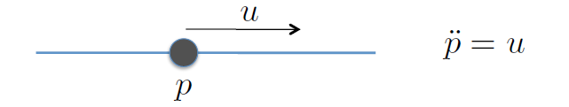
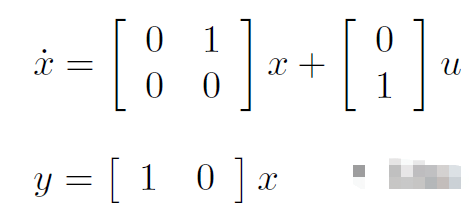
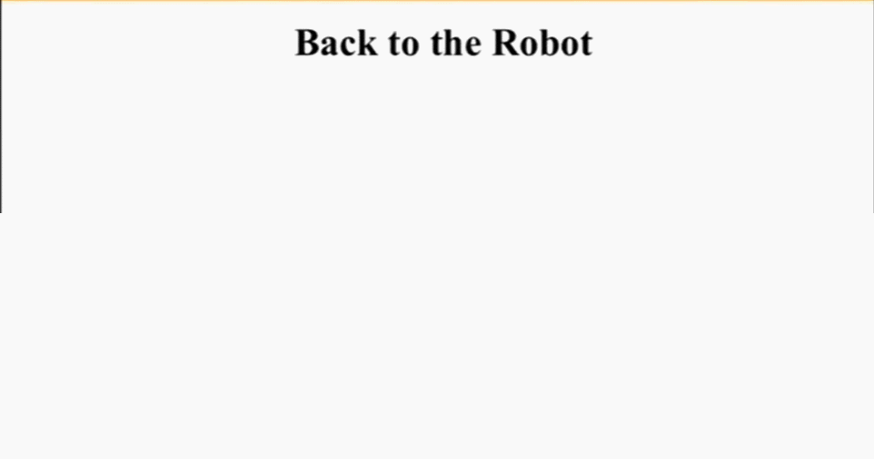
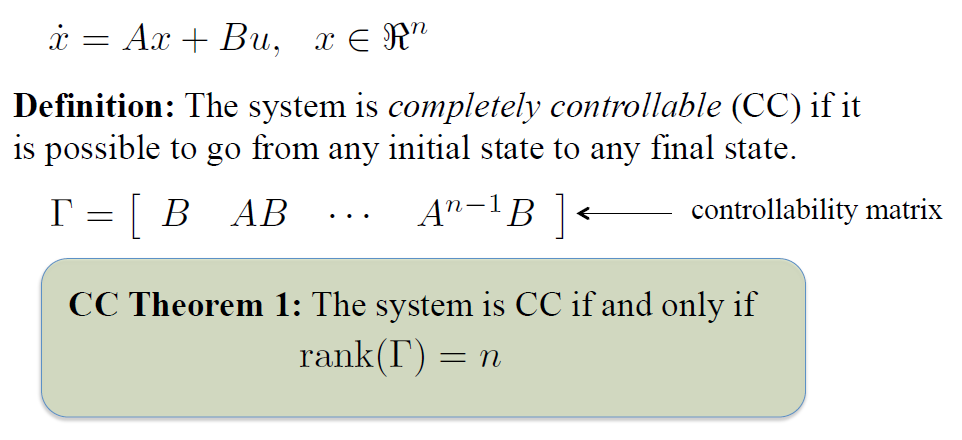
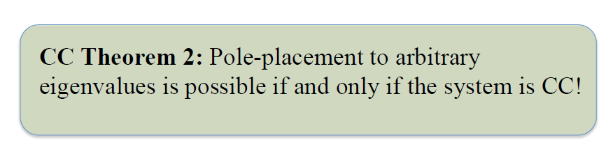
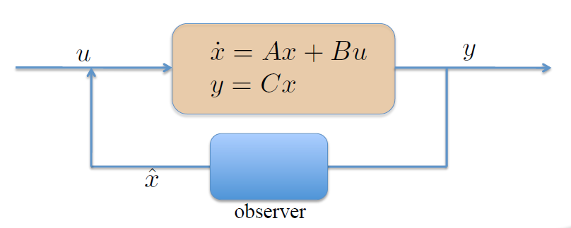
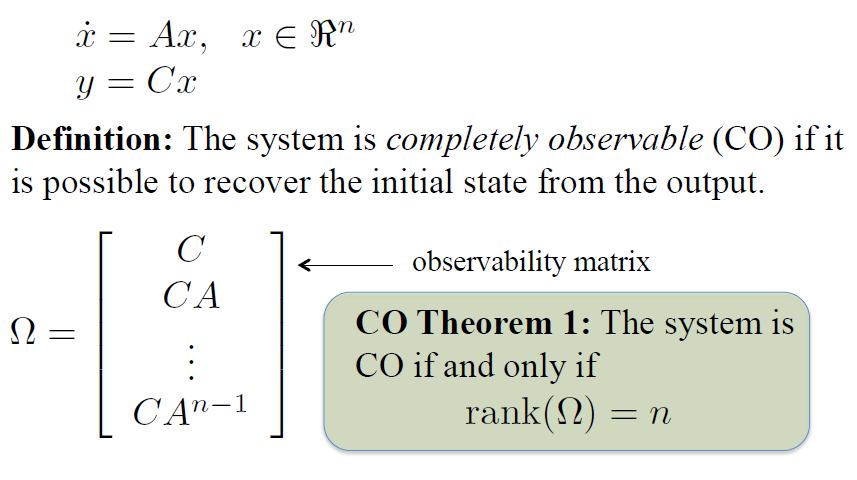
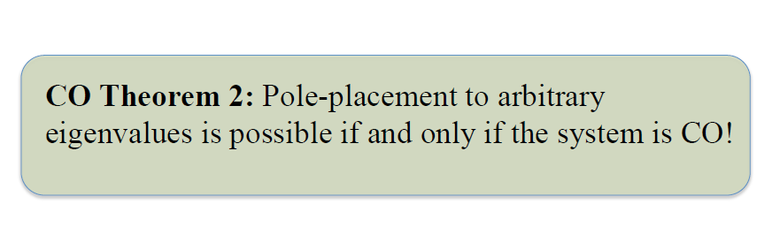

<u>Control of mobile robot</u> 是Gatech的Dr. Magnus Egerstedt在Coursera上发布的一个公开课(现在好像没在Coursera了，这位老师也不在Gatech了，我是看了[Youtube上的课程](https://www.youtube.com/watch?v=aSwCMK96NOw&list=PLp8ijpvp8iCvFDYdcXqqYU5Ibl_aOqwjr))。之前没有自主移动机器人方面的基础，学习的同时记录一下。
课件是从[github](https://github.com/rakendrathapa/mobile-robots)上下载的。
这里记录了3.7,3.8~4.4的内容；

概要如下
[TOC]

### Output Feedback and State Feedback (3.7,3.8)
#### 问题描述
对于一个直接控制的质点（Pdoubledot = u,这是一个线性系统），我们想设计一个控制器，使得它能够快速，稳定的到达坐标系原点。

#### 输出反馈控制器设计
> Idea 1: 将系统的输出（y）作为设计控制器的参考依据，来设计控制器；

即u = -Ky; 
下一步就是要计算这个系统的`状态转换矩阵`的特征值，设计K，使得整个系统处于稳定状态（渐进稳定或者严格稳定）；

我们知道A，B和C。
如果我们取K=1，那么计算之后的结果是：
eig(A − BKC) = ±j；严格稳定。

#### 结果分析
运行结果如下：

<u>质点来回振荡</u>

#### 状态反馈控制器设计
> Idea 2: 将系统的状态（x）作为设计控制器的参考依据，来设计控制器；

即设计为：u=-Kx;
这里K是1x2矩阵；取为[k1, k2]；
1） 假设取k1=k2=1；
计算结果是：渐进稳定，有振荡；

2） 假设取k1=0.1, k2=1;
计算结果是：渐进稳定，少量振荡；

#### 要解决的问题
是什么量在控制着振荡？是什么量在控制着控制的快慢？

### Stabilizing the Point Mass (4.1) and Pole Placement (4.2)
我们要确定控制矩阵K以及特征值（负实部）。用Pole Placement方法，在MATLAB中很快的计算出对应特征值的K
> P=[lambda1,lambda2,lambda3,…];
> K=place(A,B,P);

具体的思想是：
1) 状态转换矩阵A的特征矩阵(lambda I - A)的行列式记为XA(lambda);
2) 特征值多项式

先取满足稳定的特征值，再将特征矩阵行列式与展开的特征多项式按系数一一对应，确定K；

> 结论是：
> * 稳定性(stability)
> * 振荡(oscillations)
> * 收敛速度(Rate of convergence)
> 以上三个量与特征值之间的关系如下：
> * 特征值实部全<0,稳定
> * 虚部不为0，则有振荡
> * 收敛速度和最小的特征值有关（最小意味着和复数域更接近）。 最小的特征值离复数域（复数轴）越远，收敛速度越快。

### Controlability (4.3, 4.4)
这里只需要知道Controlablity的两个Theorem就可以了；
Theorem 1: 
> 
> n 是系统状态的维度，根据A和B组成的T（gamma)的秩判断，该系统是否是完全可控的。

紧接着是Theorem 2:
> 
> CC 则可以对任意特征值pole placement;即可以让系统稳定；

### Observers (4.5) and Observability (4.6)
我们的目标是从系统的输出（可以通过传感器测到）得到系统的状态。

Idea is add a observer which input is y, output is estimation of system state, noted as x-hat. 

1. observer dynamics x-hat-dot是什么样的？
答： 这里的模型是：predictor-corrector; x = Aˆx + L(y − Cˆx)x = Aˆx + L(y − Cˆx)

如果我们想让estimation x-hat更接近与系统实际状态x，那么将error e = x - x-hat -> 0，即将e stabilize(稳定化)。

Observablity Theorem 1:

对于上述系统来说，它是否CO(completely observable, 从输出回复初始状态), omega是满秩的；

如果是CO，那么可以Pole placement；

### The Separation Principle (4.7)
将controlablity和observability结合：
1） u = -Kx， 那么，要稳定状态x，即系统是稳定的；
2） 但是我们不知道x，只知道x-hat。 假设用x-hat代替x，再稳定error。

幸运的是，同时稳定x和e是可以的，用分块矩阵方法。这样，得到一个可控可测的反馈控制系统。
